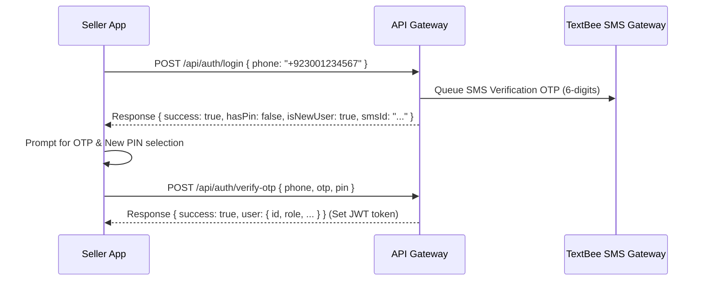

# HunarAangan: Seller Mobile Application Specifications

This document serves as the complete technical blueprint and reference manual for building the HunarAangan Seller Mobile Application. It details the design system, typography, localized layout guidelines, custom PIN login/lockout authentication strategy, dashboard requirements, and dynamic API route specifications.

---

## 1. Design System & Aesthetics

The mobile application must provide a premium, modern, and highly interactive user experience. It should wow users at first glance, leveraging vibrant yet harmonious color palettes, smooth animations, and cultural textures.

### Color Palette
The application uses a **Sandstone and Emerald** curated theme:
- **Primary / Brand Accent**: Emerald Green (`#0F9668` to `#056B49` gradient) for checkouts, primary actions, and success badges.
- **Secondary / Neutrals**: Warm Sandstone Slate. 
  - Neutral Backgrounds: Light Sandstone (`#FDFBF7`) / Sleek Dark Sandstone (`#1C1B19`).
  - Cards & Containers: Off-White Cream (`#F7F3EB`) / Charcoal Gray (`#2C2A26`).
- **Interactive States**: Smooth tap/hover scale animations (e.g., scaling down by 2-3% on touch press), gradient button fills, and clean micro-interactions.

### Typography & Language Font Engine
The application fully supports English, Urdu, and Sindhi. The app must dynamically load and apply appropriate fonts based on the selected language:
- **English (EN)**: **Outfit** or **Inter** (clean, modern sans-serif headings and body text).
- **Urdu (UR)**: **Noto Nastaliq Urdu** (rendered with adequate line-height, minimum `1.6x` line height, to prevent Nastaliq script overlaps).
- **Sindhi (SD)**: **MB Lateefi** (optimized for Sindhi letterforms with correct letter-spacing and vertical centering offsets).

> [!IMPORTANT]
> Because Sindhi (`MB Lateefi`) and Urdu (`Noto Nastaliq Urdu`) script shapes require larger bounding boxes, the app's rendering engine must dynamically adjust vertical margins, paddings, and button heights when the locale changes to prevent text clipping.

---

## 2. Authentication Flow (OTP & PIN Lockout)

Sellers register and log in using their mobile phone number. Authentication is based on a passwordless OTP (One-Time Password) combined with a secure 4-to-6 digit PIN.

### First-Time Registration / Login Flow


### Subsequent Login Flow
If a user already has a PIN configured:
1. Seller app sends `POST /api/auth/login` with `{ phone }`.
2. Server responds with `{ success: true, hasPin: true }`.
3. Seller app prompts the user directly for their 4-to-6 digit PIN.
4. Seller app sends `POST /api/auth/verify-pin` with `{ phone, pin }`.
5. If matches, the server returns the session payload and auth token.

### Locked State & Reset Flow
- **PIN Verification Attempts**: The server allows up to **5 consecutive failed attempts**.
- **Auto-Lockout reset**: On the 5th failed attempt, the server increments to 0, automatically generates a new password-reset OTP code, queues it via TextBee, and returns `{ resetRequired: true, error: "..." }`.
- **Reset Form**: The app must transition to the Verification Screen, prompting the user to enter the SMS verification code and specify a new PIN.
- **Manual Reset**: If the user forgets their PIN, they can click "Forgot PIN", which calls `/api/auth/send-reset-otp` to receive a verification OTP.

---

## 3. Seller Dashboard Requirements

The dashboard serves as the central hub for the artisan's business. It must stack elements cleanly on mobile screens and handle loading or connection failures gracefully with retry options.

### A. Home/Main Screen
- **Key Metrics Grid**:
  - *Active Listings*: Total products currently on sale.
  - *Pending Sales*: Number of active orders in packaging/shipment phase.
  - *Total Earnings*: Total payments already released to the seller's wallet.
  - *Available Balance*: Funds available for payout request (`Released Payments` minus `Approved Payouts`).
- **Quick Links**: "Add Listing" button, "Request Payout" drawer, and "Messages" icon with unread indicator badge.

### B. Product Listing Management
- **Listing Gallery**: Displays all products owned by the seller. If empty, show an illustrative fallback stating "No Products" with a clear CTA to list a new item.
- **Product Creator Form**:
  - Form Fields: Title, Main Category (e.g., Ajrak, Rilli, Embroidery, Food), Short Description, Detailed Description, Price (PKR), FAQs (dynamic question-answer arrays), Custom Service check (for customizable work).
  - Image Uploads: Supports selecting multiple images. Images are uploaded to Cloudinary via `/api/upload`; raw Base64 data URLs must **never** be saved directly into the database.
  - **Dynamic AI Translation**: If the seller inputs descriptions in English, Urdu, or Sindhi, the backend's OpenAI translation engine automatically propagates the text into the other two languages.

### C. Collapsible Sales Orders Tracker
- **Sales List**: Displays active and completed orders in reverse-chronological order.
- **Collapsible Summary Card**: Initially displays the Order ID, creation date, total price, and simple status label. Clicking it expands to reveal:
  - *Recipient Details*: Buyer's name, shipping address, contact phone number (pre-populated from the buyer's profile for custom offers).
  - *Tracking Stepper*: Visual tracking steps (`Placed` -> `Packed` -> `Shipped` -> `Delivered`).
  - *Shipment History Timeline*: Displays sequential transit updates with timestamps (e.g., *"Package packed at Saeedabad"*).
  - *Transit Logger Form*: A text box and city input allow the seller (or delivery agent) to append shipment updates (`POST /api/orders`) directly.
  - *Delivery Confirmation*: Buttons to mark the status as "Shipped" or "Delivered". Marking the status as "Delivered" automatically releases funds from Escrow to the seller's wallet.

### D. Payouts Panel
- **Balance Details**: Renders Total Earnings, Requested Payouts, and the exact Available Balance.
- **Payout Form**: Allows the seller to request a payout by entering the target amount and payment details (e.g., *"EasyPaisa Account: 03001234567"*).
- **Request History**: Displays an audit list of past requests, showing status (`Pending`, `Approved`, or `Rejected`).
- **Transparency Audit Details**: When a payout is marked `Approved` by the admin, the app must display the admin's verified `transactionId` and description notes inline on the historical card.

### E. Messages & Custom Offers
- **Chat Rooms**: Displays a list of active buyer conversations sorted by last activity.
- **Chat Screen**: Real-time communication containing audio files and text message nodes.
- **Custom Offer Builder**: Allows artisans to generate custom agreements inside the chat box:
  - Input fields: Custom Offer Title, Description, Cost (Rs.), Delivery Time (days).
  - Offers display as interactive cards within the chat timeline.
  - State logic: The buyer can "Approve" (which automatically creates the escrow order in the database and pre-fills shipping details from their profile) or "Decline".
  - The seller can press "Mark Task Complete" once finished, updating the tracking state.

---

## 4. API Reference Manual

> [!NOTE]
> All payload bodies must be sent as `application/json`. Authentication headers should include the JWT token stored on device storage (e.g., `Cookie: auth_token=...` or `Authorization: Bearer <token>`).

### 1. Authentication

#### A. Send/Check OTP (`POST /api/auth/login`)
Checks if a phone number exists. If it exists and has a configured PIN, asks for PIN. Otherwise, sends a verification SMS OTP.
- **Request Body**:
  ```json
  {
    "phone": "+923001234567"
  }
  ```
- **Success Response (New User / No PIN configured)**:
  ```json
  {
    "success": true,
    "hasPin": false,
    "isNewUser": true,
    "smsId": "6a34eaab77015dcde1611414"
  }
  ```
- **Success Response (Existing User with PIN)**:
  ```json
  {
    "success": true,
    "hasPin": true,
    "isNewUser": false
  }
  ```

#### B. Verify PIN (`POST /api/auth/verify-pin`)
Validates the user's secure PIN for logging in.
- **Request Body**:
  ```json
  {
    "phone": "+923001234567",
    "pin": "123456"
  }
  ```
- **Success Response (Cookie Set automatically in headers)**:
  ```json
  {
    "success": true,
    "user": {
      "id": "603d2b02f83d902d184752b1",
      "phone": "+923001234567",
      "name": "Sultana Begum",
      "role": "seller",
      "location": "Hyderabad",
      "bio": {
        "en": "Welcome to my store!",
        "ur": "ہنر آنگن اسٹور پر خوش آمدید!",
        "sd": "هنر آنگن اسٽور تي ڀليڪار!"
      }
    }
  }
  ```
- **Error Response (Failed / Locked Out)**:
  ```json
  {
    "success": false,
    "error": "Too many incorrect attempts. A verification reset code has been sent to your phone.",
    "resetRequired": true,
    "smsId": "6a34eaab77015dcde1611414"
  }
  ```

#### C. Verify OTP & Set PIN (`POST /api/auth/verify-otp`)
Verifies the SMS OTP and saves the newly specified secure PIN code.
- **Request Body**:
  ```json
  {
    "phone": "+923001234567",
    "otp": "482019",
    "pin": "123456"
  }
  ```
- **Success Response**:
  ```json
  {
    "success": true,
    "user": {
      "id": "603d2b02f83d902d184752b1",
      "phone": "+923001234567",
      "name": "Sultana Begum",
      "role": "seller"
    }
  }
  ```

#### D. Request PIN Reset OTP (`POST /api/auth/send-reset-otp`)
Requests a manual verification code reset sent via TextBee SMS.
- **Request Body**:
  ```json
  {
    "phone": "+923001234567"
  }
  ```
- **Success Response**:
  ```json
  {
    "success": true,
    "smsId": "6a34eaab77015dcde1611414"
  }
  ```

---

### 2. Profile Management

#### A. Fetch Profile (`GET /api/profile?userId=...`)
- **Success Response**:
  ```json
  {
    "success": true,
    "user": {
      "_id": "603d2b02f83d902d184752b1",
      "phone": "+923001234567",
      "role": "seller",
      "name": "Sultana Begum",
      "gender": "female",
      "cnic": "42201-1234567-8",
      "address": "Saeedabad Phase 2, Hyderabad",
      "location": "Hyderabad",
      "profileImage": "https://res.cloudinary.com/hunar/image/upload/v1/profile.jpg",
      "bio": {
        "en": "Traditional Rilli artisan from Sindh.",
        "ur": "سندھ سے روایتی رلی کاریگر۔",
        "sd": "سنڌ مان روايتي رلي ڪاريگر."
      }
    }
  }
  ```

#### B. Update Profile/Register (`PUT /api/profile`)
Saves profile data. Note: The app should capture name, gender, bio, role, location, etc. on the registration page and invoke this.
- **Request Body**:
  ```json
  {
    "userId": "603d2b02f83d902d184752b1",
    "name": "Sultana Begum",
    "gender": "female",
    "role": "seller",
    "location": "Hyderabad",
    "cnic": "42201-1234567-8",
    "address": "Saeedabad Phase 2, Hyderabad",
    "bio": "Traditional Rilli artisan from Sindh.",
    "lang": "sd"
  }
  ```
- **Success Response**:
  ```json
  {
    "success": true,
    "user": { ... }
  }
  ```

---

### 3. Product Listings

#### A. Retrieve Seller's Products (`GET /api/products?sellerId=...`)
- **Success Response**:
  ```json
  {
    "success": true,
    "products": [
      {
        "_id": "603d2b02f83d902d18475850",
        "sellerId": "603d2b02f83d902d184752b1",
        "title": {
          "en": "Handmade Sindhi Ajrak Shawl",
          "ur": "ہاتھ سے بنا سندھی اجرک شال",
          "sd": "هٿ سان ٺهيل سنڌي اجرڪ شال"
        },
        "price": 2500,
        "images": ["https://res.cloudinary.com/hunar/product1.jpg"],
        "category": "Ajrak",
        "isCustomService": false
      }
    ]
  }
  ```

#### B. Create Product Listing (`POST /api/products`)
Creates a new listing. Auto-translates raw text fields using backend OpenAI service.
- **Request Body**:
  ```json
  {
    "sellerId": "603d2b02f83d902d184752b1",
    "title": "Traditional Sindhi Ajrak",
    "description": "Premium quality indigo block printed cotton shawl.",
    "shortDescription": "100% Cotton traditional Ajrak.",
    "price": 2500,
    "images": [
      "https://res.cloudinary.com/hunar/ajrak1.jpg"
    ],
    "category": "Ajrak",
    "isCustomService": false,
    "faqs": [
      {
        "question": "Is it washable?",
        "answer": "Yes, wash separately in cold water."
      }
    ]
  }
  ```
- **Success Response**:
  ```json
  {
    "success": true,
    "product": { ... }
  }
  ```

#### C. Edit Product (`PUT /api/products/[id]`)
Updates product fields. Expects the same parameters as POST.

#### D. Delete Product (`DELETE /api/products/[id]`)
Deletes the product.
- **Success Response**:
  ```json
  {
    "success": true,
    "message": "Product deleted successfully."
  }
  ```

---

### 4. Sales Orders Management

#### A. Fetch Sales History (`GET /api/orders?userId=...&role=seller`)
Retrieves all orders where the caller is the seller.
- **Success Response**:
  ```json
  {
    "success": true,
    "orders": [
      {
        "_id": "604d2e82f83d902d18479900",
        "buyerId": {
          "name": "Zubair Khan",
          "phone": "+923219876543",
          "location": "Karachi"
        },
        "sellerId": "603d2b02f83d902d184752b1",
        "productId": {
          "_id": "603d2b02f83d902d18475850",
          "title": { "en": "Sindhi Ajrak Shawl", "ur": "سندھی اجرک شال", "sd": "سنڌي اجرڪ شال" },
          "price": 2500
        },
        "amount": 2500,
        "paymentMethod": "Mock_Card",
        "paymentStatus": "Paid_Escrow",
        "deliveryStatus": "Placed",
        "shippingAddress": "Gulshan-e-Iqbal, Block 5, Karachi",
        "recipientPhone": "+923219876543",
        "recipientName": "Zubair Khan",
        "shipmentHistory": [
          {
            "location": "Seller Hub",
            "status": "Order Placed & Escrow Secured",
            "timestamp": "2026-06-24T10:00:00.000Z"
          }
        ]
      }
    ]
  }
  ```

#### B. Log Shipment Update / Change Status (`PUT /api/orders`)
Enables the seller (or courier) to append tracking events and alter states.
- **Request Body (Append Timeline Log)**:
  ```json
  {
    "orderId": "604d2e82f83d902d18479900",
    "deliveryStatus": "Shipped",
    "shipmentUpdate": {
      "location": "Hyderabad Sorting Office",
      "status": "Package in transit to Karachi"
    }
  }
  ```
- **Request Body (Deliver & Auto-Release Payment)**:
  ```json
  {
    "orderId": "604d2e82f83d902d18479900",
    "deliveryStatus": "Delivered",
    "shipmentUpdate": {
      "location": "Karachi Destination Hub",
      "status": "Delivered to buyer and payment released"
    }
  }
  ```
- **Success Response**:
  ```json
  {
    "success": true,
    "order": { ... }
  }
  ```

---

### 5. Payouts

#### A. Get Payout History & Balances (`GET /api/payouts?sellerId=...`)
- **Success Response**:
  ```json
  {
    "success": true,
    "availableBalance": 4500,
    "totalReleased": 12500,
    "totalRequested": 8000,
    "requests": [
      {
        "_id": "604e3001f83d902d18480101",
        "sellerId": "603d2b02f83d902d184752b1",
        "amount": 5000,
        "status": "Approved",
        "paymentDetails": "EasyPaisa Mobile Account: 03001234567",
        "transactionId": "TXN99281775",
        "transactionDetails": "Disbursed via Habib Bank Limited Escrow payout portal. Trn ref 88201.",
        "createdAt": "2026-06-20T12:00:00.000Z",
        "resolvedAt": "2026-06-21T09:00:00.000Z"
      }
    ]
  }
  ```

#### B. Create Payout Request (`POST /api/payouts`)
Sellers request to withdraw their cleared available balance.
- **Request Body**:
  ```json
  {
    "sellerId": "603d2b02f83d902d184752b1",
    "amount": 3000,
    "paymentDetails": "EasyPaisa Mobile Account: 03001234567, Name: Sultana Begum"
  }
  ```
- **Success Response**:
  ```json
  {
    "success": true,
    "payoutRequest": { ... }
  }
  ```

---

### 6. Chat System & Custom Offers

#### A. Fetch Rooms List (`GET /api/chat/rooms?userId=...`)
Returns chat channels associated with the seller.
- **Success Response**:
  ```json
  {
    "success": true,
    "rooms": [
      {
        "roomId": "buyerId_sellerId",
        "buyerId": { "_id": "603d2111f8...", "name": "Zubair Khan", "phone": "+92321..." },
        "sellerId": { "_id": "603d2b02f8...", "name": "Sultana Begum", "phone": "+92300..." },
        "messages": [
          {
            "senderId": "603d2111f8...",
            "text": "Can you prepare Ajrak in 5 days?",
            "timestamp": "2026-06-24T10:05:00.000Z"
          }
        ]
      }
    ]
  }
  ```

#### B. Create Chat Message (`POST /api/chat/message`)
Sends a message. Supports voice notes via optional `audioUrl`.
- **Request Body**:
  ```json
  {
    "roomId": "buyerId_sellerId",
    "senderId": "603d2b02f83d902d184752b1",
    "text": "Yes, I can design custom block prints.",
    "audioUrl": null
  }
  ```
- **Success Response**:
  ```json
  {
    "success": true,
    "chatRoom": { ... }
  }
  ```

#### C. Custom Offer Dispatch (`POST /api/chat/offer`)
Sellers dispatch customized items or orders via chat for buyer approval.
- **Request Body (Action: Create Offer)**:
  ```json
  {
    "roomId": "buyerId_sellerId",
    "senderId": "603d2b02f83d902d184752b1",
    "offerAction": "create",
    "offerDetails": {
      "title": "Custom Handwoven Ajrak Dress",
      "description": "5 Yards cotton dress material, indigo Block Printed.",
      "amount": "4500",
      "deliveryTime": "7"
    }
  }
  ```
- **Request Body (Action: Complete Task)**:
  Sellers click this to alert the client that the work is finished.
  ```json
  {
    "roomId": "buyerId_sellerId",
    "senderId": "603d2b02f83d902d184752b1",
    "offerAction": "update",
    "messageId": "604e3502f83d902d184890",
    "offerDetails": {
      "status": "completed"
    }
  }
  ```
- **Success Response**:
  ```json
  {
    "success": true,
    "chatRoom": { ... }
  }
  ```

---

### 7. File Uploads

#### A. Cloudinary Upload (`POST /api/upload`)
Allows uploading files using a standard Multipart `FormData` payload.
- **Request Headers**:
  - `Content-Type`: `multipart/form-data`
- **Request Form Fields**:
  - `file`: The binary image file.
  - `type`: `profile` or `product`.
- **Success Response**:
  ```json
  {
    "success": true,
    "url": "https://res.cloudinary.com/hunar/image/upload/v178176859/ajrak_image.jpg",
    "cloudinary": true
  }
  ```
